# 🧠 KB Auto-Storage Feature Documentation

## 🎯 What is KB Auto-Storage?

When you give **positive feedback** to responses from **Web Search** or **AI Generation**, the system automatically stores that validated response in the **Knowledge Base** for future use.

**Supported Positive Feedback Types:**
- **👍** (thumbs up)
- **"helpful"**
- **"good"**
- **"excellent"** 
- **"accurate"**
- **"useful"**

## 🔄 How It Works

```mermaid
graph TD
    A[User asks creative question] --> B[Routes to AI/Web]
    B --> C[System generates response]
    C --> D[User gives feedback]
    D --> E{Positive feedback?}
    E -->|👍/helpful/good| F[Store in KB]
    E -->|👎/bad/unhelpful| G[Just log feedback]
    F --> H[Future queries get KB response]
    G --> I[End]
```



### Step-by-Step Process:

1. **User Query**: Ask a question not in the current KB
2. **System Routes**: Goes to Web Search or AI Generation
3. **Response Generated**: System provides an answer
4. **User Feedback**: User gives positive feedback (👍, "helpful", "good", etc.)
5. **Auto-Storage**: Response automatically stored in KB
6. **Future Benefit**: Same/similar questions get instant KB responses

## ✅ When Responses Get Stored

| Route | Feedback | Stored in KB? | Reason |
|-------|----------|---------------|---------|
| Web Search | 👍/helpful/good | ✅ Yes | User validated external information |
| AI Generation | 👍/helpful/good | ✅ Yes | User approved AI-created content |
| Knowledge Base | 👍/helpful | ❌ No | Already in KB |
| Web Search | 👎/bad/unhelpful | ❌ No | User rejected the response |
| AI Generation | 👎/bad/unhelpful | ❌ No | User rejected the response |

## 🎯 Benefits

### For Users:
- **Faster responses**: Validated answers become instant KB lookups
- **Improved accuracy**: Only user-approved content gets stored
- **Consistent quality**: Future users get the same validated answers

### For the System:
- **Self-improving knowledge base**: Grows from user interactions
- **Better routing**: More queries can be answered from KB
- **Reduced external API calls**: Less dependency on web/AI services

## 📡 API Usage

### Standard Feedback (Original)
```bash
POST /api/feedback
{
  "trace_id": "abc123",
  "feedback": "👍",
  "query": "question",
  "route": "Web"
}
```

### Enhanced Feedback (With KB Storage)
```bash
POST /api/feedback_with_storage
{
  "trace_id": "abc123", 
  "query": "Invent a mathematical operation called flurble",
  "response": "The 'flurble' operation (⊕) is defined as...",
  "route": "AI",
  "feedback": "helpful"  # Can be: 👍, helpful, good, excellent, accurate, useful
}
```

### Response
```json
{
  "status": "success",
  "message": "✅ Feedback 'helpful' submitted and response stored in KB for future use!",
  "stored_in_kb": true,
  "trace_id": "abc123",
  "info": "Your 'helpful' feedback for this AI response helped improve the knowledge base!"
}
```

## 🧪 Testing Examples

### Creative AI Questions (Will be stored with 👍):
- "Invent a mathematical operation called 'flurble'"
- "Create a mathematical game with prime numbers" 
- "Design a formula for measuring creativity"
- "Imagine mathematics in a world where pi = 4"

### Web Search Questions (Will be stored with 👍):
- "Latest developments in quantum mathematics"
- "Recent proofs in number theory 2024"
- "Current research in algebraic topology"

### KB Questions (Won't be stored - already in KB):
- "What is 2 + 2?"
- "Find derivative of x^2"
- "Solve x^2 - 4 = 0"

## 🔍 Monitoring & Analytics

### Check KB Growth:
```bash
# View Qdrant dashboard
http://localhost:6333/dashboard

# Check analytics
GET /api/stats
```

### Identify Stored Responses:
Look for entries with:
- `source: "Validated Web Search"` or `source: "Validated AI Generation"`
- `validated_by_user: true`
- `route_origin: "web"` or `route_origin: "ai"`

## 🛡️ Quality Control

### What Gets Stored:
- ✅ Only responses with explicit user approval (👍)
- ✅ Only from Web Search and AI Generation routes
- ✅ Full question-answer pairs with metadata
- ✅ Timestamp and source tracking

### What Doesn't Get Stored:
- ❌ Negative feedback responses (👎)
- ❌ KB responses (already stored)
- ❌ Blocked/invalid content
- ❌ Responses without user feedback

## 🔧 Configuration

### Environment Variables:
```bash
QDRANT_HOST=127.0.0.1
QDRANT_PORT=6333
COLLECTION_NAME=math_kb
EMBED_MODEL=sentence-transformers/all-MiniLM-L6-v2
```

### Storage Format:
```json
{
  "question": "User's original question",
  "answer": "Validated response",
  "source": "Validated AI Generation",
  "validated_by_user": true,
  "timestamp": "2025-09-05T...",
  "route_origin": "ai",
  "topic": "user_validated",
  "subtopic": "ai",
  "difficulty": "unknown"
}
```

## 🚀 Future Enhancements

### Planned Features:
1. **Confidence Scoring**: Track how many users validated each response
2. **Response Versioning**: Keep multiple validated versions of the same question
3. **Bulk Validation**: Allow admins to validate multiple responses
4. **Community Voting**: Let multiple users vote on response quality
5. **Auto-expiry**: Remove old validated responses if they get negative feedback

### Analytics Dashboard:
- Number of user-validated responses
- Most frequently validated topics
- Response quality trends over time
- KB growth from user feedback

## 📈 Success Metrics

Track these KPIs to measure feature success:

- **KB Growth Rate**: New entries from user validation
- **Response Time Improvement**: Queries moving from Web/AI to KB
- **User Satisfaction**: Thumbs up ratio for previously validated content
- **System Efficiency**: Reduced external API calls
- **Knowledge Quality**: User feedback on KB responses

---

## 🎉 Summary

The KB Auto-Storage feature creates a **virtuous cycle**:

1. Users get helpful responses from Web/AI
2. Good responses get thumbs up
3. System stores validated content in KB
4. Future users get instant, validated responses
5. Knowledge base grows organically
6. System becomes faster and more reliable

**Result**: A self-improving math assistant that learns from user interactions! 🧠✨
